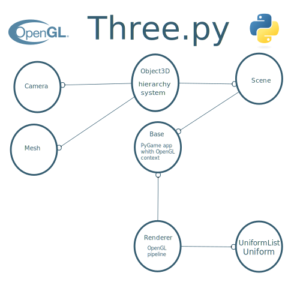

three.py
========

#### Python 3D library ####

The aim of this project is to create an easy to use 3D library for Python.

This project was inspired by [Three.js](https://threejs.org/), and attempts to follow the effective and reliable class structure from that project whenever possible.

Three.py was originally designed for educational purposes, and rendering efficiency and optimization will occasionally be sacrificed for simplicity and clarity.

To see what the Three.py library is capable of, see the [list of examples](https://github.com/stemkoski/three.py/wiki/Examples) or watch the [sample projects video](https://www.youtube.com/watch?v=vs6LdP6pWKI).

[](https://www.youtube.com/watch?v=vs6LdP6pWKI)

This project was initially developed by Lee Stemkoski and Michael Pascale.

This project uses the MIT license.

### Usage ###

Three.py uses the Python libraries [PyGame](https://www.pygame.org/), [PyOpenGL](http://pyopengl.sourceforge.net/), and [NumPy](http://www.numpy.org/). 

The following code creates a scene, a camera, ambient and directional lights, and adds a light blue cube to the scene. It animates (spins) the cube, and allows the user to move the camera with first-person controls.

```python
from core import *
from cameras import *
from lights import *
from geometry import *
from material import *

class TestCube(Base):
    
    def initialize(self):

        self.setWindowTitle('Cube')
        self.setWindowSize(800,600)

        self.renderer = Renderer()
        self.renderer.setViewportSize(800,600)
        self.renderer.setClearColor(0.25,0.25,0.25)
        
        self.scene = Scene()
        
        self.camera = PerspectiveCamera()
        self.camera.transform.setPosition(0, 1, 7)
        self.camera.transform.lookAt(0, 0, 0)
        self.cameraControls = FirstPersonController(self.input, self.camera)

        self.scene.add( AmbientLight(strength=0.25) )
        self.scene.add( DirectionalLight(direction=[-1,-1,-1]) )

        self.cube = Mesh( BoxGeometry(), SurfaceLightMaterial(color=[0.5,0.5,1.0]) )
        self.scene.add(self.cube)
        
    def update(self):
        
        self.cameraControls.update()

        if self.input.resize():
            size = self.input.getWindowSize()
            self.camera.setAspectRatio( size["width"]/size["height"] )
            self.renderer.setViewportSize(size["width"], size["height"])
                
        self.cube.transform.rotateX(0.02, Matrix.LOCAL)
        self.cube.transform.rotateY(0.03, Matrix.LOCAL)
        
        self.renderer.render(self.scene, self.camera)
                    
# instantiate and run the program
TestCube().run()
```

In case you are having difficulties related to versions of the dependencies (PyGame, PyOpenGL, NumPy), a [pipenv](https://docs.pipenv.org/en/latest/) pipfile is provided to set up a [virtualenv](https://virtualenv.pypa.io/en/latest/).
It can be used as follows:

```bash
pip install pipenv
pipenv install
pipenv shell
cd three.py
python TestAnimatedDayNight.py
```

# Three.py structure


# Contributing to Three.py

Thank you for your interest in contributing to the Three.py repository! Your contributions are greatly appreciated.

To maintain a healthy and productive community, we have established guidelines that we expect contributors to follow. By following these guidelines, you help ensure that the repository remains accessible and beneficial to all members of the community.

Please read this document carefully before making any contributions to the repository. If you have any questions or concerns, please do not hesitate to reach out to us through the repository's issue tracker.

## Contributing Guidelines


We welcome contributions in the form of bug reports, feature requests, documentation improvements, and code contributions. Before making a contribution, please take the following steps:

1. If you are reporting a bug, please ensure that it has not already been reported by checking the repository's issue tracker.

2. If you are requesting a feature, please describe it in as much detail as possible.

3. If you are making a code contribution, please make sure your code adheres to the repository's coding standards and passes all relevant tests.

4. Make sure to sign all your commits and pull requests with a GPG key. This helps us verify that you are authorized to make the changes you are proposing.

### Reporting Issues

If you encounter an issue with the repository, please report it through the issue tracker. When reporting an issue, please include the following information:

1. A detailed description of the issue, including any error messages or other relevant information.

2. Steps to reproduce the issue.

3. Any additional information that may help us diagnose and fix the issue.

### Feature Requests

If you have a feature request, please submit it through the issue tracker. When submitting a feature request, please include the following information:

1. A detailed description of the feature you would like to see.

2. A rationale for why you think the feature would be useful.

3. Any additional information that may help us understand and implement the feature.

### Code Contributions
If you would like to contribute code to the repository, please follow these steps:

1. Fork the repository and clone your fork.

2. Create a new branch for your changes.

3. Make your changes and commit them to your branch.

4. Push your branch to your fork.

5. Open a pull request from your branch to the main repository.

6. Wait for a maintainer to review your changes.

7. Address any feedback provided by the maintainer.

8. Once your changes have been approved, they will be merged into the main repository.

Thank you for your interest in contributing to the Three.py repository! We look forward to your contributions.
